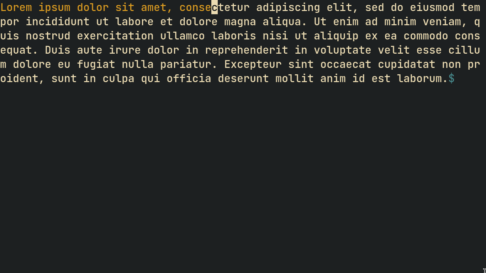

# Typing Practise


A TUI typing practise application which can be run on arbitrary
files. This is **NOT** a trainer.

## Quick Start
- Depends on [ncurses](https://invisible-island.net/ncurses/)
- This project uses [make.h](https://github.com/shoumodip/make.h)

```console
$ cc -o make make.c
$ ./make run
```

## Usage
This application goes through the files in the command line arguments
one by one and makes the user practise on them.

```console
$ asdf [FILES]
$ asdf lorem.txt asdf.c
```

There is no timer, no whiz-bang sound effects, no timers or
real-time WPM displayers, etc. The interface consists of just the text
and the cursor, nothing else. This provides for a distraction-free
typing environment.

On exiting the application or when the text it has been running on has
ended, your WPM and accuracy percentage is informed to you.

```console
$ asdf lorem.txt
WPM: 149.94
Accuracy: 97.34
```
